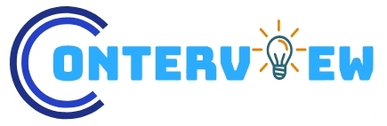
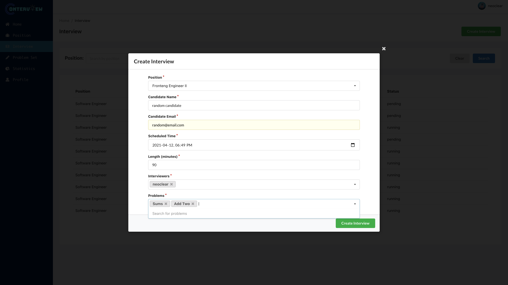

  

  

    This is Conterview, a website for continuous coding interview conduction. Recruiters are allowed to create, conduct and manage coding interviews on conterview.
     
     
    Practice, and get a job with us
     
     
    <a href="https://www.conterview.com/">Website</a>
  

## Technologies Used

+ [mongodb](https://www.mongodb.com/)
  + [mongoose](https://mongoosejs.com/)
+ [express.js](https://expressjs.com/)
+ [Semantic UI](https://semantic-ui.com/)
+ [Ant Design](https://ant.design/)
+ [Socket.IO](https://socket.io/)
+ [PeerJS](https://peerjs.com/)
+ [Docker](https://www.docker.com/)
+ [Monaco Editor](https://microsoft.github.io/monaco-editor/)
+ [ChartJS](https://www.chartjs.org/)

## Team Members
+ Ziheng Zhuang ziheng.zhuang@mail.utoronto.ca

  Code execution engine designer, interview page synchronizer and server owner

+ Quanhong Liu quanhong.liu@mail.utoronto.ca

  Conterview authorizer, dashboard creater and deployment expert

+ Qingtian Wang qingtian.wang@mail.utoronto.ca

  Dashboard creater and problem solver

## [Video Link](https://www.youtube.com/watch?v=2RTqSSH7_k4)

## [Backend API Link](Backend-API.md)

## Features

- ### Register / Login

  

- ### Home Page / Recent Events

  

- ### Profile

  

- ### Position Creation

  

- ### List Problems

  

- ### Create Problems

  

- ### Statistics

  

- ### List Interviews

  

- ### Create Interview

  

- ### Interview Dashboard

  

- ### Interview Page

  

- ### Video Sharing

  

- ### Interview Testing

  

- ### Javascript / Typescript Intellisense

  

- ### Interview Control Panel

  

